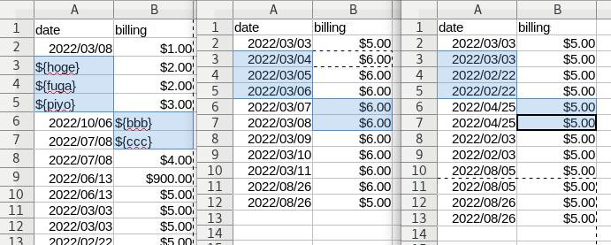
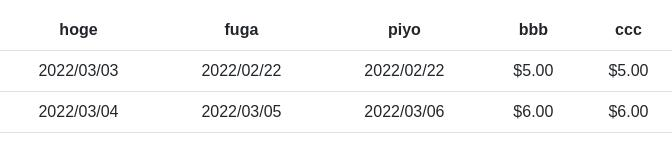

# xlsx2rows

obtains rows tuples from multiple xlsx files by your template.

## input of this module

- single template xlsx file which has vars surround by `${}` values in its cells
- multiple xlsx files which has values in same position of template-vars e.g. `${XXX}`



## output of this module

- tuples with its fields named by e.g. `XXX` that was surrounded by `${}` in template



## how to use

```
import xlsx2rows from 'xlsx2rows';

// setup
const run = xlsx2rows({
    source: xlsx files in blob forms
    template: xlsx file in blob form
});

// obtains rows
const tuples = await run();

// goal
[
{ source: blob file 0, tuple: { XXX: 1, YYY:'2', ZZZ: undefined } }
{ source: blob file 1, tuple: { XXX: 1, YYY:'2', ZZZ: undefined } }
...
]
```
